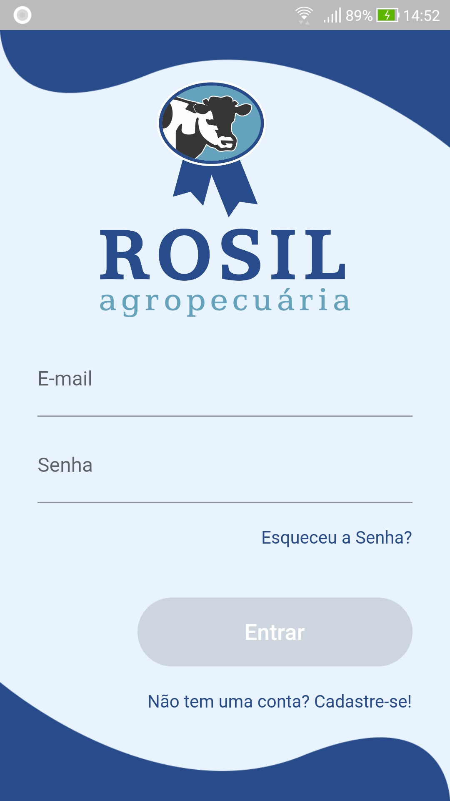
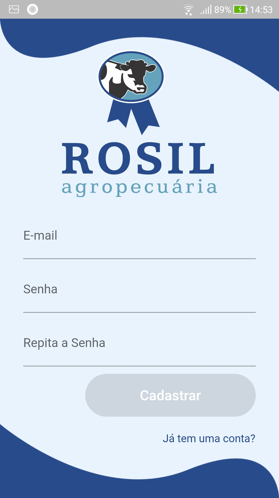
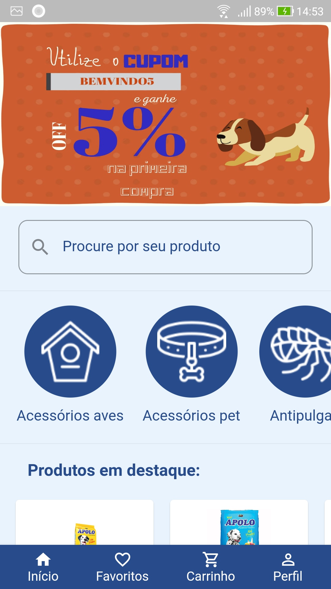
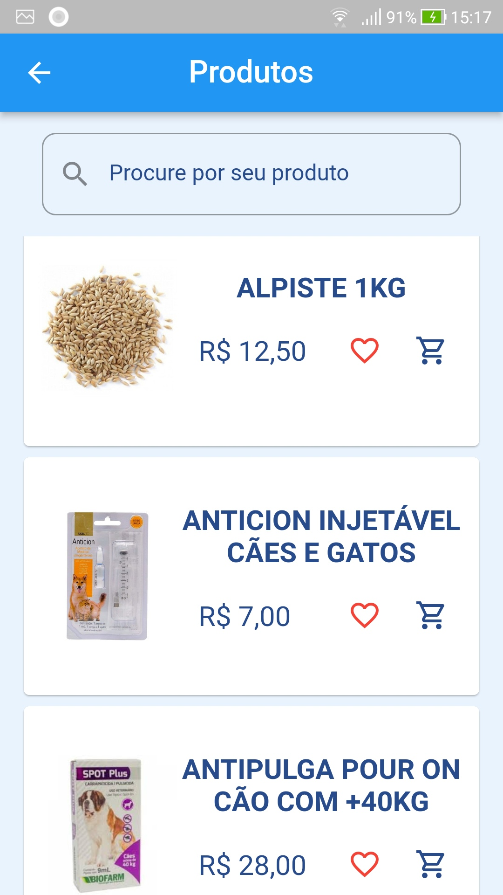
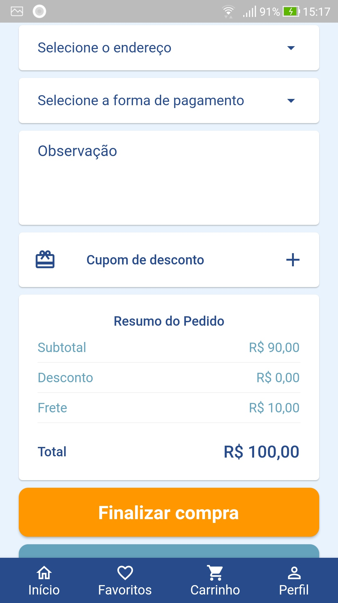
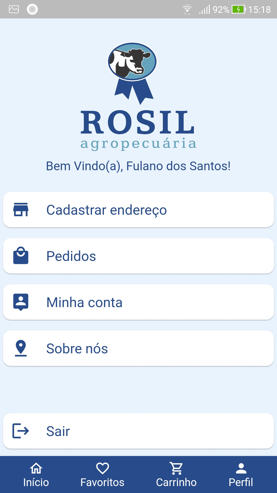
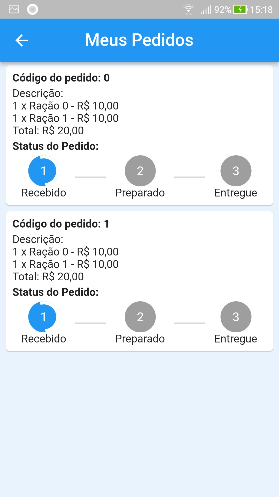

# Rosil Agropecuária
Este projeto é um app de vendas online para uma agropecuária.

#

#

## Tecnologias usadas
- Dart, Flutter
- Mobx
- Modular
- Firebase
- Clean Arch

## Como Usar o aplicativo
O aplicativo conta com uma tela de login, e cadastro por e-mail. 

Após o cadastro, e ou login, o usuario é direcionado para a home page, nela é possivel selecionar uma categoria de produtos, o usuario então é direcionado para a tela de produtos.

Na tela de produtos o usuario pode favoritar seus produtos ou coloca-los em seu carrinho de compras.

O app conta com uma tela de carrinho de compras, onde é possivel alterar quantidade de produtos, inserir o endereço aonde vai ser entregue, selecionar a forma de pagamento, colocar alguma observação, e um campo para cupom de desconto.

Também conta com uma area de perfil do usuario, onde é possivel ele cadastrar seus endereços, editar seus dados e conferir seus pedidos.

## Prints de algumas telas

